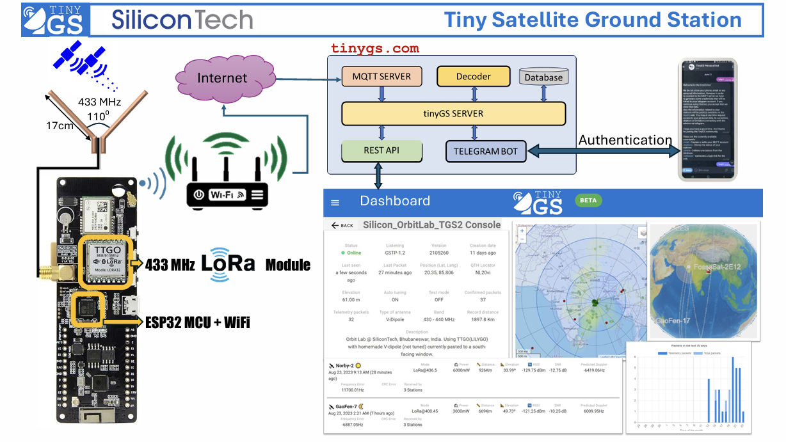

# Tiny Satellite Ground Station

In this project, we established a ground station using TinyGS with an ESP32 and SX1278 LoRa module. Our custom Arduino code receives telemetry data and visualizes it on the serial plotter, enabling seamless satellite communication. This innovative setup showcases the power of LoRa technology in connecting with orbiting satellites.
# Hardware

This project utilizes the ESP32 microcontroller paired with the SX1278 LoRa module, providing an efficient solution for satellite communication. It is compatible with a variety of ESP32 development boards, ensuring flexibility in hardware selection.

Currently supported hardware includes:

* **Heltec WiFi LoRa 32 V1** (433MHz & 863-928MHz versions)
* **Heltec WiFi LoRa 32 V2** (433MHz & 863-928MHz versions)
* **TTGO LoRa32 V1** (433MHz & 868-915MHz versions)
* **TTGO LoRa32 V2** (433MHz & 868-915MHz versions)
* **TTGO LoRa32 V2** (Manually swapped SX1267 to SX1278)
* **T-BEAM + OLED** (433MHz & 868-915MHz versions)
* **T-BEAM V1.0 + OLED**
* **FOSSA 1W Ground Station** (433MHz & 868-915MHz versions)
* **ESP32 dev board + SX126X with crystal** (Custom build, OLED optional)
* **ESP32 dev board + SX126X with TCXO** (Custom build, OLED optional)
* **ESP32 dev board + SX127X** (Custom build, OLED optional)
* **ESP32-S3 150–960Mhz - HELTEC LORA32 V3 SX1262**
* **ESP32-S3 433Mhz Custom ESP32-S3 433MHz SX1278**

Additionally, any ESP32 board with an SX1278 module can be configured using templates, allowing for customization to meet specific project requirements. For more detailed information on setup and compatibility, please refer to the [documentation](https://github.com/G4lile0/tinyGS/wiki/Board-Templates)

# Install

------

#### Setting Up Your Board for the First Time . Just go to https://installer.tinygs.com and follow the instructions there

-----

The first time you flash your board you can use the [web installer](https://installer.tinygs.com) using Google Chrome web browser on Linux, Windows or MacOS. Follow instructions there.

You can also download the latest [release](https://github.com/G4lile0/tinyGS/releases) and flash it with PlatformIO. If you dont know PlatformIO here you have our [PlatformIO guide](https://github.com/G4lile0/tinyGS/wiki/Platformio).

Later you can update your Ground Station via [local web OTA or auto update method](https://github.com/G4lile0/tinyGS/wiki/OTA-Update).

You can also use Arduino IDE, but is a longer and hard path, because you need to install all dependencies. [Arduino guide](https://github.com/G4lile0/tinyGS/wiki/Arduino-IDE)

# Main data website

All data received by TinyGS Ground Stations are showed at our TinyGS website

[https://tinygs.com/](https://tinygs.com/)

At this web you can see:

- [Ground Stations list](https://tinygs.com/stations)
- [Supported satellites](https://tinygs.com/satellites)
- [All data packets received by the community in real time](https://tinygs.com/packets)

At your personal area you can edit some parameters of your Ground Stations remotely.

This is the main data recovery system, but we are developing an API to access data.

# Local data access

You can access your Ground Station's data and configuration through a local web interface. Simply use the respective IP address assigned to your board in your browser to view and manage the data.

Also you can use the serial port of your board to see the basic console.
