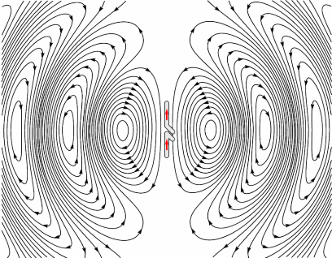

# Tiny Satellite Ground Station

In this project, we established a ground station using TinyGS with an ESP32 and SX1278 LoRa module. Our custom Arduino code receives telemetry data and visualizes it on the serial plotter, enabling seamless satellite communication. This innovative setup showcases the power of LoRa technology in connecting with orbiting satellites.
# Hardware

This project utilizes the ESP32 microcontroller paired with the SX1278 LoRa module, providing an efficient solution for satellite communication. It is compatible with a variety of ESP32 development boards, ensuring flexibility in hardware selection.

Currently supported hardware includes:

* **Heltec WiFi LoRa 32 V1** (433MHz & 863-928MHz versions)
* **Heltec WiFi LoRa 32 V2** (433MHz & 863-928MHz versions)
* **TTGO LoRa32 V1** (433MHz & 868-915MHz versions)
* **TTGO LoRa32 V2** (433MHz & 868-915MHz versions)
* **TTGO LoRa32 V2** (Manually swapped SX1267 to SX1278)
* **T-BEAM + OLED** (433MHz & 868-915MHz versions)
* **T-BEAM V1.0 + OLED**
* **FOSSA 1W Ground Station** (433MHz & 868-915MHz versions)
* **ESP32 dev board + SX126X with crystal** (Custom build, OLED optional)
* **ESP32 dev board + SX126X with TCXO** (Custom build, OLED optional)
* **ESP32 dev board + SX127X** (Custom build, OLED optional)
* **ESP32-S3 150–960Mhz - HELTEC LORA32 V3 SX1262**
* **ESP32-S3 433Mhz Custom ESP32-S3 433MHz SX1278**

Additionally, any ESP32 board with an SX1278 module can be configured using templates, allowing for customization to meet specific project requirements. For more detailed information on setup and compatibility, please refer to the [documentation](https://github.com/G4lile0/tinyGS/wiki/Board-Templates)

# Our Custom Ground Station Hardware Setup
We have developed a custom ground station by soldering an ESP32 and LoRa SX1278 module onto a PCB. Additionally, we have integrated a 0.96-inch OLED display using an I2C connection for easy visualization. This setup is used to receive telemetry data efficiently and enhances the overall communication experience in our Tiny Satellite Ground Station.

# Install

------

#### Setting Up Your Board for the First Time . Just go to https://installer.tinygs.com and follow the instructions there

-----

The first time you flash your board you can use the [web installer](https://installer.tinygs.com) using Google Chrome web browser on Linux, Windows or MacOS. Follow instructions there.

You can also download the latest [release](https://github.com/G4lile0/tinyGS/releases) and flash it with PlatformIO. If you dont know PlatformIO here you have our [PlatformIO guide](https://github.com/G4lile0/tinyGS/wiki/Platformio).

Later you can update your Ground Station via [local web OTA or auto update method](https://github.com/G4lile0/tinyGS/wiki/OTA-Update).

You can also use Arduino IDE, but is a longer and hard path, because you need to install all dependencies. [Arduino guide](https://github.com/G4lile0/tinyGS/wiki/Arduino-IDE)

# Antenna

To ensure optimal reception and transmission for the ground station, a properly tuned antenna is crucial. For this project, we recommend designing and using a **¼-wave ground-plane antenna**. The steps involve both setting up the embedded system with the TinyGS firmware and tuning the antenna using a **nanoVNA** (Vector Network Analyzer) for precise measurements.

### Steps:
1. **Install and setup TinyGS firmware** on the ESP32-LoRa embedded system:
   - Follow the steps to install the TinyGS firmware, which enables the ESP32 to communicate with satellites and function as a LoRa ground station.
   - Ensure the ESP32 is properly connected to the LoRa module (SX1278) and all configurations are correct.

2. **Antenna design**:
   - Design a **¼-wave ground-plane antenna**, ideal for the 433 MHz frequency used by LoRa.
   - The antenna length can be calculated using the formula: 
   **Formula**:
     `L = 300 / (4 * Frequency)`
      
   Where:
   - `L` is the length of the antenna in meters.
   - `Frequency` is the operating frequency in MHz.
   - 300 is the speed of light in a vacuum (in megahertz * meters).

## For example, for a frequency of 433 MHz:
 Explanation:
 Wavelength (λ) of a radio wave is the distance it travels in one cycle and is given by 
 𝜆=𝑐/𝑓,
 where 
 c is the speed of light and 
 f is the frequency

### For a LoRa system operating at 433 MHz:

  L= 300 / (4 x 433)
  L≈ (300 / 1732) = **0.173 meters** = **17.3 cm**
​

3. **Antenna tuning**:
   - Use a **nanoVNA** to tune the antenna for minimum **SWR (Standing Wave Ratio)**, ensuring it resonates well at the desired frequency.
   - Adjust the radials and main element length as needed to achieve a good match and reduce loss during signal transmission and reception.
  
     

     
     

   
### Radiation Pattern of a Dipole Antenna

The radiation pattern of a dipole antenna is crucial for understanding its performance in different directions. A standard half-wave dipole antenna radiates energy in a **doughnut-shaped pattern**, with the strongest radiation occurring perpendicular to the axis of the antenna.
     

     
     

     
#### Key Characteristics:
- **Omnidirectional in the horizontal plane**: The dipole antenna radiates equally in all directions along the horizontal plane, making it effective for long-range communication in all directions.
- **Minimal radiation at the ends**: Along the axis of the dipole (at the tips), the radiation is weakest, meaning that the antenna's performance is reduced in the directions along its length.
- **Figure-eight pattern**: When viewed from the side, the radiation pattern resembles a figure-eight shape, with the strongest lobes perpendicular to the antenna.

This pattern makes dipole antennas ideal for ground station setups where coverage in all horizontal directions is needed, but the vertical direction is less critical.

# Full-Duplex Communication Using RadioLib and Custom SPI in LoRa Subsystems

By utilizing **RadioLib** and a **custom SPI** setup, we can create an efficient communication channel between two LoRa subsystems. Although LoRa technology is designed for half-duplex operation, we can simulate full-duplex communication by rapidly switching between transmit and receive modes.

#### Custom SPI Pin Configuration:
For the ESP32, we define custom SPI pins to interface with the SX1278 LoRa module:

- **MOSI (Master Out Slave In)**: GPIO 27  
- **MISO (Master In Slave Out)**: GPIO 19  
- **SCK (Serial Clock)**: GPIO 5  
- **NSS (Chip Select)**: GPIO 18  
- **RST (Reset)**: GPIO 14  
- **DIO0 (Interrupt)**: GPIO 26  
- **DIO1 (Optional for better reception)**: GPIO 32

This custom SPI setup ensures reliable communication between the ESP32 and the LoRa transceiver, allowing us to manage data transmission and reception efficiently.

#### Optimized Setup for Communication:
1. **Hardware Configuration**:
   - Two ESP32 boards, each connected to an SX1278 LoRa module using the custom SPI pinout listed above.
   - The nodes alternate between transmitting and receiving, simulating a full-duplex channel with minimal delay.

2. **Efficient Data Transmission**:
   - Using **RadioLib**, the LoRa nodes are dynamically switched between `startTransmit()` and `startReceive()` functions, enabling near real-time communication with low latency.
   - **Collision Avoidance**: By controlling timing between the two nodes, packet collisions are avoided, ensuring smooth data flow.

3. **Performance and Power Optimization**:
   - **Minimal Latency**: The fast switching between transmit and receive ensures continuous data flow with almost no lag.
   - **Error Handling**: Features like CRC (Cyclic Redundancy Check) guarantee data integrity even under noisy conditions.

This setup provides a highly responsive and efficient communication link between two LoRa systems using a custom SPI configuration, simulating full-duplex functionality.

# Developing the Ground Station Receiver System for CubeSat Telemetry

This section covers the development of the software system for receiving CubeSat telemetry data using the `RadioLib` and `SPI` libraries. The receiver code, [`receiver.ino`](receiver.ino), enables full communication with a LoRa-based CubeSat, forming the core component of our ground station.

### How the Code Works:

The [`receiver.ino`](receiver.ino) file initializes the **LoRa module** (SX1278) using custom SPI pins on the ESP32 and sets the necessary parameters, including frequency, bandwidth, and spreading factor. Once initialized, it begins to **listen for incoming telemetry packets** from the CubeSat.

**Key points in the code:**
- **Custom SPI Pin Configuration:**
   The custom SPI pins for ESP32 are configured as follows:
   - `MOSI (27)`
   - `MISO (19)`
   - `SCK (5)`
   - `NSS (18)`
   - `RST (14)`
   - `DIO0 (26)`
   - `DIO1 (32)`

- **Packet Reception and Data Handling:**
   The system continuously listens for incoming packets and uses the `setFlag()` function to handle received packets. Upon successful reception, it prints important telemetry data such as:
   - **Received data**
   - **RSSI** (Received Signal Strength Indicator)
   - **SNR** (Signal-to-Noise Ratio)
   - **Frequency error**

- **Error Handling:**
   If a packet is malformed, the system flags a **CRC error**, while other error codes are logged for further debugging.

#### Install Required Libraries:
The necessary libraries, **RadioLib** and **SPI**, are included in the `libraries` folder of this repository. To install them:

- Navigate to the `libraries` folder in the cloned repository.
- Copy the `RadioLib` and `SPI` folders.
- Paste them into your Arduino IDE’s libraries directory. This is typically located in your Documents under `Arduino/libraries`.

#### Open the Receiver Code:
- Open the Arduino IDE.
- Go to **File** > **Open** and select the `receiver.ino` file from the cloned repository.

#### Select the Correct Board:
In the Arduino IDE:

- Navigate to **Tools** > **Board** and select **ESP32 Dev Module** (or your specific ESP32 variant).

#### Upload the Code:
- Connect your ESP32 board to your computer using a USB cable.
- Select the COM port.
- Click on the **Upload** button in the Arduino IDE (the right arrow icon).
- Wait for the code to compile and upload to the ESP32.

#### Open the Serial Monitor:
- After uploading, open the Serial Monitor by going to **Tools** > **Serial Monitor** (or pressing `Ctrl + Shift + M`).
- Set the baud rate to `115200` to view the telemetry data being received.

The system will now listen for incoming telemetry packets from the CubeSat, displaying the received data along with key parameters like **RSSI** and **SNR** in the Serial Monitor.

